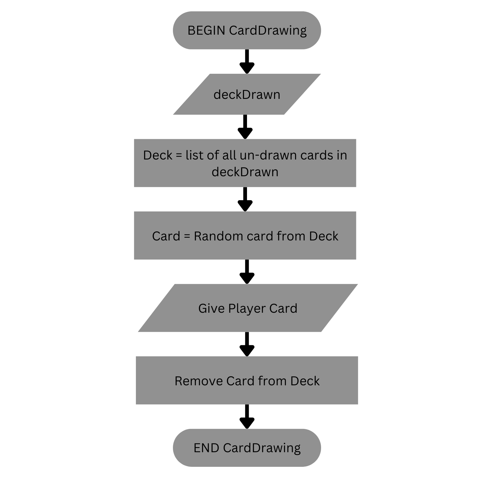
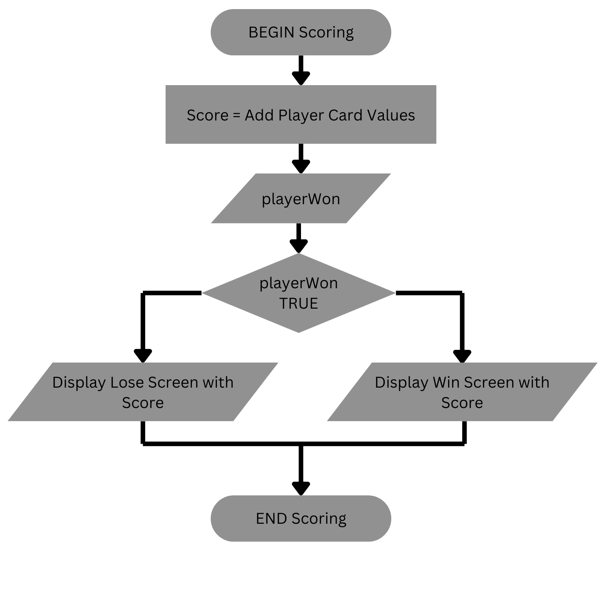

# 9CT1A Task #3 Part B.

---

## Identifying And Defining
### Identifying a need

#### Brainstorming
* Improving critical thinking skills in children | Detective Game
* Improving reaction times among kids | Whack-a-mole style game.
* Memory skills | Card Match Game
* Memory, critical thinking, logic, numeracy amongst children | Card Game Suite

#### Identify
**Need:** To improve children's memory, critical thinking skills, logic, and numeracy skills via an engaging game consisting of several small card games. \
**Problem Statement:** Children (6 -> 11, G) are often only able to focus on things they find fun and exciting, this proves to be a problem within classrooms, due to the ever decreasing attention spans within young children. This means that educational yet fun games are vital to their learning. A game that provides a suite of card games could easily prove to be a great assistance within the classroom. By having students play simple games such as Oicho-Kabu, Irish Rummy-O, Etc... \
**Skill Development:** I would develop any required skills for making this game by looking at things like Stackover-flow solutions.

#### Requirements Outline
**Inputs:** User inputs will be mouse clicks for selecting the amount of money, cards and actions, as the game will be mainly UI based, and we will need inputs from the save files to store player data. \
**Processing:**
The program will process the inputs and update the game score as well as the cards, table, and other stats. \
**Outputs:** The game will often run the processed changed on the input, then play a sound for some virtual "tactile" feedback, and then display the updated screen. \
**Transmission:** The project will not require any transmission as all accounts are local. \
**Storage:** High scores on games need to be stored, usernames and passwords, to help schools have multiple students per computer.

#### Functional Requirements
**User Interaction:** Users will interact through the system via clicking cards or actions on the UI, essentially just selecting options, This can be to draw new cards / move to the next step of the card game. \
**Core Gameplay or Simulation Mechanics:** Randomisation for the card drawing, basic math, and algorithmic decisions by the computer on what's the best move. \
**Scoring and Feedback:** At the end of each match the game will show the player their score, if they won or lost etc... but the purpose of the game is to not give the players any real number feedback so the students can gain math skills. \
**Saving and Loading Data:** The game will handle saving and loading data via saving the statistics into am ENCRYPTED JSON at any important moments, and then on the restart of the game they would load the stats from the same ENCRYPTED JSON file. The ENCRYPTED JSON file would be stored locally on the user's device.
#### Non-Functional Requirements Instructions
**Performance Requirements:** The game should load within 5-10 seconds and provide feedback to the user (sound), that their inputs have been registered instantly, actual processing is alright to take time as card games are turn based. \
**Usability Requirements:** The user interface should require no onscreen prompts besides itself, though for each game a tutorial would be made as its expected for the user to be introduced to card games they haven't played before. \
**Compatibility Requirements:** The game should run as a simple PC game, as well as a browser game so schools don't have to download anything. It would also be preferred if they didn't require strong computers. \
**Scalability Requirements:** The game should have no issues scaling as each game will have its own script, essentially making it a library for games. So the only real scalability requirement would be a scrollable level select menu, or paged system, so its as simple as coding a new card game. \
**Security Requirements:** To prevent anyone cheating in scores, or using other peoples accounts, all usernames and passwords will be hashed in SHA256 then stored in the ENCRYPTED JSON which will be encrypted through a key hard coded into the game. The password will then be hashed in SHA256 then checked with the pre-existing hash to see if they are equal. \
**Reliability and Availability:** The system should be able to handle simple errors like crashing by reverting to the last save file.
### Consideration of Social and Ethical Issues
#### Definitions
**Equity:**
Equity is defined as "fairness and justice", not to be confused with equality. Where-in equality believes everyone should have the same starting point, Equity believes we should all have the same finish point. Meaning those in-need are given more leeway and assistance than those who find themselves ahead. \
**Accessibility:**
Accessibility is often seen as the ability to access and benefit from a system. This is often seen in technology through assistive features such as colour blindness modes, text to speech, etc.
#### Paragraphs
**Accessibility:** \
Accessibility is always a hard topic in games, as how can we make a game accessible without making it play itself. My game will try to cover every area where it can make its self more accesible through assistive tech, however there are a few things it can not account for. First a foremost, its a math game, there's no way to play this game unless you're capable of simple instructions, and math; It's just the reality of this game. Secondly this game is meant as a suplementary resource, as such a teachers guidance over a student would provide atleast a decent amount of assistance for users. With this said I still plan to implement assistive tech throughout the game without making it a toggle or obvious. Simple things like a little bit of screen shake alongside basic button click sounds for deaf users. Using fonts that work for dyslexic people in the tutorial, and having the tutorial read out to the user. Using colours that contrast easily for all variants of colour blindness. I could also provide a way to interact with the cards beyond the mouse, potentially including a direction keyboard input (via mouse keys) to select different things. There's various ways I'm planning on making my game accessible, but none of them will be a toggle, as the game should work well for any user, as is. \
**Privacy and Data Protection:** \
Collecting simple data is essential to any games function. My game will require information such as high scores per user, usernames and passwords. Etc. But all of this will be encrypted within a locally stored JSON, and the user will be informed of this every boot of the game. Even within the ENCRYPTED JSON, passwords will be hashed into SHA256 making it realistically impossible to crack into plaintext. Even in the situations where a bad actor gets into another users account, there is no information stored on the players account except username, highscores, accessories (such as card packs). \
**Fairness and Representation:** \
Depictions of characters can easily become offensive and harmful even when its not intended. Luckily my game does not involve any characters, as its simply cards, and all drawing on those cards will be based off of traditional designs from widely accepted brands. Thanks to this there is no platform for my game to share stereotypes or bias. \
**Mental and Emotional Well-Being:** \
All media can have a deep impact on their audience's mental health, games included. However my game is made to be a simple happy golucky card-game suite to help students with their math skills. At all times the game should be chirpy with positive music in the background to pursuade players into feeling at ease during gameplay. Gameplay is simple and will contain no violent characteristics as its a simple card game. In the case where any games are added that can include negative imagery (be-it violence or otherwise), that game will have a warning produced when the user attempts to boot into it, giving them a chance to rethink their decision. \
**Cultural Sensitivites:** \
Whilst I'm not planning on my game being culturally dissensitive there are some foreseeable situations where this could occur. Examples of this include, incorrect rules wihtin games which could be considered disrespect, using names that have inappropriate connotation for primary schools, or including games associated with gambling. All of these are legitimate concerns when it comes to any game, but to assure the game's open nature for all culture, research will be done into the background of all games so I can make a more culturally accurate decision.

---

## Researching Planning
### Evaluating Existing Ideas
| Game                                                                               | Plus                                                                                                                                                                                                                                                                                                                                                                                                                                                      | Minus                                                                                                                                                                                                                                                                                                                                                                                                                                                                                                            | Implications                                                                                                                                                                                                                                                                                                                                                                                                  |
| :--------------------------------------------------------------------------------- | :-------------------------------------------------------------------------------------------------------------------------------------------------------------------------------------------------------------------------------------------------------------------------------------------------------------------------------------------------------------------------------------------------------------------------------------------------------- | :--------------------------------------------------------------------------------------------------------------------------------------------------------------------------------------------------------------------------------------------------------------------------------------------------------------------------------------------------------------------------------------------------------------------------------------------------------------------------------------------------------------- | :------------------------------------------------------------------------------------------------------------------------------------------------------------------------------------------------------------------------------------------------------------------------------------------------------------------------------------------------------------------------------------------------------------ |
| **Table Top Simulator** <br /> | **-** Tabletop simulator has the ability <br />to simulate any boardgame or <br />card game to a simple degree. <br />(i.e Uno, Dungeons and Dragons, <br />Monopoly) <br />**-** Physics allow for real feeling dice rolls, <br />less gameified elements, making it <br />feel better to play. <br />**-** Customisability allows for a different<br /> experience for each player, making <br />players have something to work<br />towards.           | **-** Tabletop simulator has complicated UI that <br />can often be hard to use and can make it <br /> difficult for the user to play it intuitively. <br /> **-** Rules are not automatic, and its essentially <br />just a physics simulator, meaning players <br />need to manage the rules and regulations<br /> by themselves which can often become a hastle.<br /> **-** AI is nonexistent within TTS (Tabletop Simulator) <br />which makes it so you have to either have friends<br /> or find a lobby. | **-** The  basic few implications <br /> of tabletop simulator's mechanics <br />are all based upon the anti <br />gameiness of the project.<br /> As I find the card game experience<br /> to be far more immersive when <br />it feels like I'm actually playing with <br /> cards. As such I'll try to avoid <br />gamey features like seethrough cards <br />etc... having an animation for most features |
| **UNO!<sup>TM</sup>** <br />                                 | **-** Uno allows for rule changes to <br />the base game, allowing "house"<br /> rules to be server to server.<br />**-** Cards have hover animations, <br /> showing the player when they've<br /> selected a card.<br />**-** The pile in the middle feels like<br /> an actual chaotic uno pile, again<br /> removing that gamey feel.<br />**-** Graphics are simplistic yet pleasing<br /> with a good balance between <br />cartoony and realistic. | **-** Game is very limited, there are only a<br /> few things that you can actually play. <br />**-** Replayability value is low, eventually<br />uno gets stale and you have to find<br />something else to play.                                                                                                                                                                                                                                                                                               | **-** Again, we must focus on an<br /> Anti-Gamey aesthetic for the game.<br />Trying to not "baby" players/users into <br />a lull. Also focussing on that replayability <br />Games should never feel the "samey", <br />whether this is done by music, art, cool events<br />or something.                                                                                                                 |
| **Microsoft Solitaire** <br />                         | **-** Solitaire is very easy to run for bad<br /> computers, I would assume any<br /> machine that has windows can run <br />Microsoft Solitaire.<br /> **-** Very simplistic instructions, It's extremely <br />easy to grasp the game just from what we<br />are told within the game itself, this kind of<br /> independance is important.                                                                                                             | **-** Once again we find ourselves with this<br />simplicity finding itself in a bit of a lull,<br />boring the player and essentially being<br /> an advanced way of twiddling your thumbs.                                                                                                                                                                                                                                                                                                                     | **-** The game should be highly optimised so it runs easily on bad computers, <br />**-** Keep instructions simplistic so players can easily understand them.                                                                                                                                                                                                                                                 |

### Flowcharts and Pseudo Code

#### Clicking Card/UI (User Interaction)
```
BEING CardUI
	INPUT cardClicked
	IF cardClicked is 'Play' THEN
		Load Level Select Menu
	ELSE IF cardClicked is 'Normal' THEN
		Move card
END CardUI
```


#### Card Drawing
```
BEING CardDrawing
	INPUT deckDrawn
	Deck = list of all un-drawn cards
	Card = Random card from Deck
	Give Player Card
	Remove Card from Deck
END CardDrawing
```


#### Scoring and Feedback
```
BEGIN Scoring
    Score = Add Player Card Values
    INPUT playerWon
    IF playerWon is TRUE THEN
        Display win screen with Score
    ELSE THEN
    	Display lose screen with Score
END Scoring
```


#### Saving and Loading
```
BEGIN Saving
	IF Save TRUE THEN
		Values = All Saveable Values in JSON HashMap
		Encryption Key = String to encrypt with.
		Encrypted Value = Values against Encryption key
		INPUT saveFile
		Save Encrypted Value to saveFile
END Saving
```


### Storyboards

(Handed in Person)
- [x] Splash Screen
- [x] Level Select
- [x] Level Play
- [x] Basic Table Example
### Gantt Chart
